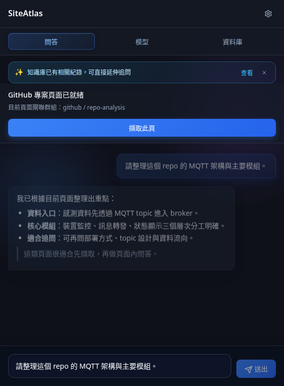
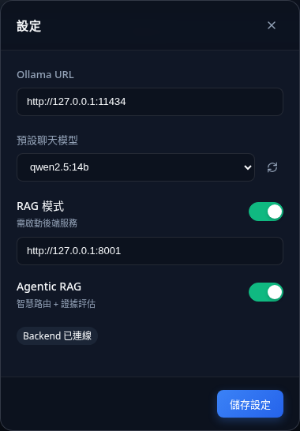
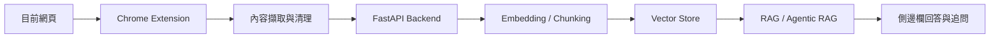

# SiteAtlas

把正在瀏覽的網頁，變成可儲存、可檢索、可追問的本地知識庫。

SiteAtlas 是一個本地 AI 驅動的 Chrome Extension + FastAPI 工具組，專注在「頁面擷取、知識庫保存、RAG 問答、Agentic RAG 推理」這條工作流。它適合用來整理研究資料、追蹤技術文件、建立個人知識庫，或在閱讀網頁時直接提問。

## 核心能力

- 擷取目前網頁內容，保留可讀文字與頁面語境
- 將頁面存入本地知識庫，之後可跨頁檢索與追問
- 支援 Direct、RAG、Agentic RAG 三種問答模式
- 可切換聊天模型、嵌入模型與視覺模型
- 內建資料庫面板，方便查看文件、chunk 與查詢範圍

## 介面預覽



在側邊欄直接擷取目前頁面，並針對當前內容延伸追問。



可切換 Ollama URL、Backend URL，以及 RAG / Agentic RAG 模式。

## 運作方式



## Quick Start

### 1. 安裝 backend 依賴

```bash
cd backend
uv venv
source .venv/bin/activate
uv pip install -r requirements.txt
```

### 2. 啟動 API

```bash
cd backend
uv run uvicorn app.main:app --reload --host 0.0.0.0 --port 8000
```

### 3. 載入 Chrome Extension

1. 打開 Chrome 的 Extensions 頁面
2. 啟用 `Developer mode`
3. 選擇 `Load unpacked`
4. 指向這個 repo 的 `extension/` 資料夾

### 4. 開始使用

1. 打開任意網頁
2. 開啟 SiteAtlas side panel
3. 先檢查 Ollama 與 backend URL
4. 點擊 `擷取此頁`
5. 直接對頁面內容提問，或切到資料庫模式做知識管理

## 專案結構

- `backend/`: FastAPI API、ingest、retrieval、chat、knowledge 管理
- `extension/`: Chrome Extension、頁面擷取腳本、side panel UI

## 使用限制

本專案僅授權個人學習、研究與其他非商業用途。

未經作者事前書面授權，不得將本專案或其衍生版本用於：

- 販售、轉售或商業授權
- 付費 SaaS、商業產品或內部營利系統
- 顧問交付、代工交付或任何直接營利場景

詳細條款請見 [LICENSE.md](LICENSE.md)。
